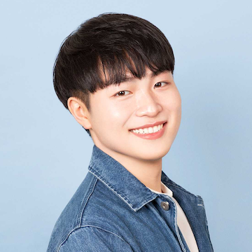

# 👋 Welcome!

## About

TDD, DDD, MSA, DDIA, 대용량 트래픽 처리 및 코드 품질에 관심이 많습니다.

개발 문화 중에서는 코드 리뷰를 가장 중요하게 생각합니다. 코드 리뷰를 통해 서로에게 기술과 도메인 지식을 빠르게 전파하는 것이 리뷰에 쏟는 시간과 노력 이상의 값어치가 있다고 믿습니다.

제품 성공을 위해 애자일하게 일하는 팀을 좋아합니다. 애자일 도구 중 하나인 Scrum에 작은 팀을 이끌 수 있을 정도로 익숙하며, 스프린트가 끝날 때마다 있는 스프린트 데모에서 팀원들과 제품에 대해 학습하고 향후 방향성을 논의하는 것을 가치있게 여깁니다.

제품을 개발하는 소프트웨어 엔지니어로서 비즈니스 가치와 관련이 깊은 코드와 그렇지 않은 코드를 구분하고, 관련이 높은 쪽에 기술적 탁월함을 집중하기 위해 온 힘을 다합니다.\

## Work Experience

|                                                                                                                                                                                                                                                                                                                              |                                                                                                                                                                                                                                                                                                                                      |
| :--------------------------------------------------------------------------------------------------------------------------------------------------------------------------------------------------------------------------------------------------------------------------------------------------------------------------: | ------------------------------------------------------------------------------------------------------------------------------------------------------------------------------------------------------------------------------------------------------------------------------------------------------------------------------------ |
| 
 <strong>Viva Republica</strong>
 | <h4>Server Developer</h4>
<strong>2021년 5월 ~ 현재</strong>  <strong></strong>Language: Kotlin
                                                                                                                                                                                                                                 |
|           
 <strong>Skelter Labs</strong>
           | 

<ul><li><h4>Software Engineer</h4>
<strong>2018년 12월 ~ 2021년 5월 (2년 6개월)</strong> <strong></strong>Language: Typescript, Kotlin

</li></ul><ul><li><h4>Software Engineering Intern</h4>
<strong>2017년 12월 ~ 2018년 12월 (1년 1개월)</strong>

Language: Kotlin, Java, Python, Javascript, Swift
</li></ul> |

## 팀에서 함께 일하기 위해

* 조직에 무언가를 건의할때 이기적(self serving)이지 않아야 한다.
* 팀 커뮤니케이션에서는 I 보단 We 를 쓰자.
* 개인보다 팀이 먼저 잘되는 걸 우선시 하자.
* 조직 차원에서 임펙트가 큰데, 메인터넌스(토들링이 필요한)는 적은 사람이 되자.
* 이유 불문 No Blame 하자.
* 잘못이 모호해도 책임을 본인이 끌어안자.
* 조직에 불안감을 해소시키는 사람이 되자.
* No 거짓말 No 핑계: "이 사람이 하는 말은 믿어도 된다" 라는 상태를 유지하자.
* 나보다 높은 추상화 레이어에 있는 사람의 우선순위와 상황을 파악/ㅇ해하고 이를 토대로 일을 선제적으로 파악/진행하자.

## &#x20;
