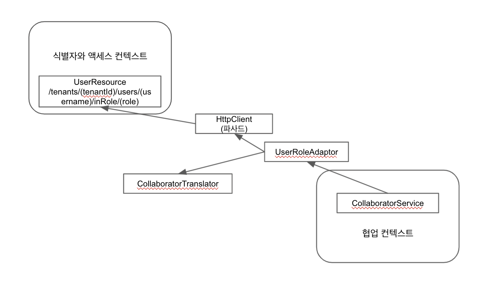

# 13장. 바운디드 컨텍스트의 통합

컨텍스트 맵은 2가지 형태가 있다.

1. 모든 바운디드 컨텍스트들 사이에 존재하는 관계의 종류를 그림으로 표현한 것
2. 모든 바운디드 컨텍스트들 사이에 존재하는 관계를 실제고 구현하는 코드

이번 장에서는 2번에 대해 다룬다.

## 통합의 기본

자주쓰이고면서 단순한 통합의 몇가지 형태가 있디.

1. API 제공하고 클라이언트가 그것을 사용하는 방식
2. 메시지 큐 메커니즘 (혹은 Pub-sub 메커니즘)
3. RESTful HTTP 사용

4번은 1번과 다르다. URI를 사용해 고유하게 식별된 리소스를 교환하고 수정할 수 있기 때문이다.

위 보다는 좀 더 복잡한 방식으로 아래와 같은 방식들이 있으나, 너무 우리들을 빨리 늙게 만든다는 단점이 있다.

5. 파일 기반의 통합
6. 공유된 데이터베이스

### 분산 시스템은 근본적으로 다르다

분산 컴퓨팅에는 원칙이 있다.

* 네트워크는 신뢰할 수 없다.
* 언제나 지연이 있을 수 있고, 심지어 많을 수도 있다.
* 대역폭은 무한하지 않다.
* 네트워크의 topology는 변화한다.
* 정보와 정책은 다수의 관리자에 걸쳐 퍼져있다.
* 네트워크 전송은 비용이 든다.
* 네트워크는 다양성을 갖고 있다.

> 반드시 해결해야 하는 문제점이나 계획해야 하는 복잡성이기 때문에 원칙이라고 부른다. 

### 시스템 경계에 걸친 정보의 교환

두 가지 접근법이 나온다.

1. 직렬화를 주고받기 위해 클래스를 배포하는 방식
2. 미디어 타입 계약을 정의하는 방식

1번 방식은 가장 최신 버전의 클래스와의 호환성을 유지하기 위해 해당 클래스를 소비하는 시스템의 재컴파일이 필요하다.
1번보다는 좀 더 쉽고 안전하지만 타입 safety를 완전히 포기하지는 않는 방식이 2번 방식이다.

예시가 나온다. 다음은 사용자 지정 미디어 타입 명세다.

```json
{ // 타입: Notification, 포맷: JSON
  "Notification": {
    "typeName": "com.yourcompany.agilepm.domain.model.product.backlogItem.BacklogItemCommitted",
    "version": 1,
    "occurredOn": "2021-08-01T07:10:44.968Z",
    "event": { // 어떤 도메인 이벤트든지 모두 올 수 있음. 여기서는 BacklogItemCommitted.
      "eventVersion": 1, // Notifiction.version과 같은 값
      "occurredOn": "2021-08-01T07:10:44.968Z", // Notifiction.occurredOn과 같은 값
      ... // BacklogItemCommitted 도메인 이벤트 세부사항들
    }
  }
}
```

이를 읽어들이기 위한 `NotificationReader`의 구현은 [여기서](https://github.com/VaughnVernon/IDDD_Samples/blob/05d95572f2ad6b85357b216d7d617b27359a360d/iddd_common/src/main/java/com/saasovation/common/notification/NotificationReader.java) 확인해볼 수 있다.
뒤에서도 계속 나오니까 링크 들어가서 한 번 봐보자.

`Notification`과 `event` 가 언제나 버전 번호를 가지고 있기 때문에 주어진 버전에 특화된 컨슈머가 필요한 부분만을 골라낼 수 있다. 
대부분의 컨슈머가 해당 이벤트의 1버전 만으로 충분한 상황에서 발생할 수 있는 비호환성의 문제로부터 컨슈머를 보호할 수 있다. 즉 이벤트가 변경되더라도
컨슈머의 변경이나 재컴파일이 필요 없다.

## RESTful 리소스를 사용한 통합
 
바운디드 컨텍스트가 URI를 통해 RESTful 리소스를 제공한다면 통합 방법 중 오픈 호스트에 해당된다. 호스트가 뻗으면 그에 의존하는 다른 바운디드 컨텍스트들이
덩달아 장애가 나지만, 타이머나 메시징을 사용하면 호스트가 뻗었을 때 타이머를 더 뒤로 미루거나, 메시지 브로커가 negative ack를 알아채고 재전송을 하거는 식으로
이를 완화할 수 있다.

### RESTful 리소스의 구현

도메인 모델을 오픈 호스트 리소스로 드러내버리면 어떻게 될까? 이건 공유된 커널이나 순응주의자에 해당하므로 하지 말아야 한다.

[UserResource](https://github.com/VaughnVernon/IDDD_Samples/blob/05d95572f2ad6b85357b216d7d617b27359a360d/iddd_identityaccess/src/main/java/com/saasovation/identityaccess/resource/UserResource.java) 클래스를 보자.

```java
@GET
@Path("{username}/autenticatedWith/{password}")
@Produces({ OvationsMediaType.ID_OVATION_TYPE })
public Response getAuthenticUser(...)
```

Media type을 응답마다 붙여서 내려주고 있다. 정의된 상수값들은 [여기서](https://github.com/VaughnVernon/IDDD_Samples/blob/05d95572f2ad6b85357b216d7d617b27359a360d/iddd_common/src/main/java/com/saasovation/common/media/OvationsMediaType.java#L17) 확인해볼 수 있고,
실제 응답의 헤더에서 `Content-Type`에서 찍히게 된다.

```
HTTP/1.1 200 OK
Content-Type: application/vnd.saasovation.idovation+json
...
{
  "role": "Author",
  "username": "zoe",
  "firstName": "Zoe",
  "lastName": "Doe",
  "emailAddress": "zoe@saasovation.com",
  "tenantId": "A94A8298-..."
}
```

### ACL(부패 방지 계층)을 통한 REST 클라이언트의 구현

위에서는 제공하는 쪽을 살펴봤으니, 이를 컨슘하는 클라이언트가 ACL을 이용해 어떻게 부패 방지를 하는지 살펴보자.



부패 방지 계층을 형성하기 위해 다음 3가지 클래스가 쓰였다.

* [CollaboratorService](https://github.com/VaughnVernon/IDDD_Samples/blob/05d95572f2ad6b85357b216d7d617b27359a360d/iddd_collaboration/src/main/java/com/saasovation/collaboration/domain/model/collaborator/CollaboratorService.java#L19)
* [UserInRoleAdaptor](https://github.com/VaughnVernon/IDDD_Samples/blob/master/iddd_collaboration/src/main/java/com/saasovation/collaboration/port/adapter/service/HttpUserInRoleAdapter.java)
* [CollaboratorTranslator](https://github.com/VaughnVernon/IDDD_Samples/blob/master/iddd_collaboration/src/main/java/com/saasovation/collaboration/port/adapter/service/CollaboratorTranslator.java)

`CollaboratorService`의 `authorFrom()` 을 통해 얻어온 [Author](https://github.com/VaughnVernon/IDDD_Samples/blob/master/iddd_collaboration/src/main/java/com/saasovation/collaboration/domain/model/collaborator/Author.java) 는
Application 서비스에서 [이렇게](https://github.com/VaughnVernon/IDDD_Samples/blob/05d95572f2ad6b85357b216d7d617b27359a360d/iddd_collaboration/src/main/java/com/saasovation/collaboration/application/forum/ForumApplicationService.java#L267-L268) 사용된다.

만약 우리가 ACL에서 애그리게잇을 생성하려는 목적이라면 리포지토리로 ACL을 구현해볼수도 있다. 그러나 위와 같이 Value Object를 생성하는 방식이라면
애그리게잇을 영속화하고 재구성하기 위한 리포지토리의 목적과는 맞지 않다.

## 메시징을 사용한 통합

메시징 인프라가 유지되는 한, 다른 시스템이 뻗어도 메시지는 전달될 수 있다는 점 때문에, 메시징 기반 통합은 서로 의존하는 시스템 보다는 더 높은 자율성을 보장받을 수 있다.

### 제품 소유자와 팀 멤버의 정보를 계속해서 제공받는 것

1. `AccessService` 의 `assignUserToRole` 에서는 `User` 와 `Role`을 리포지토리에서 찾아와서 `role.assignUser(User)`를 호출한다.
2. `assignUser` 에서는 `UserAssignedToRole` 이벤트를 발행한다.
3. 래빗 MQ를 사용하는 [ExchangeListener](https://github.com/VaughnVernon/IDDD_Samples/blob/master/iddd_common/src/main/java/com/saasovation/common/port/adapter/messaging/rabbitmq/ExchangeListener.java) 를 확장한`TeamMemberEnablerListener`가 `filteredDispatch()`로 수신된 메시지를 처리한다.
4. 위에서 메시지가 처리되면서 `EnableProductOwnerCommand`가 만들어지고 이를 전달하여 `TeamService`의 `enableProductOwner`가 불린다. 

### 당신은 책임을 감당할 수 있는가

외부 바운디드 컨텍스트의 `User`에 관한 정보를 `ProductOwner`와 `TeamMember`에 저장하도록 했다. 이 때문에 `User` 의 변화를 이벤트를 통해
계속 `ProductOwner`나 `TeamMember`를 동기화시켜주어야 한다.

A를 역할해제 해야 하는데, 관리자가 실수로 B를 해제했다고 해보자.
이벤트가 순서를 보장하지 않아서 `UserAssignedToRole`이 `UserUnassignedFromRole` 보다 먼저 도착하게 될 수도 있다.
따라서 이벤트에는 항상 `occuredOn`이 전달되고, 그 시각 기준으로 변화가 추적되어야 한다.

그러나 가능하다면 바운디드 컨텍스트 전반에서 정보의 중복을 최소화하거나 완전히 제거하는 편이 최선이다.
대부분 상황에서 ID 중복은 필수적이나 이는 불변하기 때문에 공유해도 안전하다.

### 장기 실행 프로세스와 책임의 회피

제품을 생성하라는 유스케이스의 프로세스는 다음과 같다.

1. 사용자는 제품 설명 정보를 제공한다.
2. 사용자는 팀 토론에 대한 의사를 표시한다.
3. 사용자는 정의된 제품을 만들도록 요청한다.
4. 시스템은 포럼과 토론이 들어간 제품을 만든다.

[ProductService](https://github.com/VaughnVernon/IDDD_Samples/blob/master/iddd_agilepm/src/main/java/com/saasovation/agilepm/application/product/ProductApplicationService.java#L102-L110) 에서는 `newProductWithDiscussion` 이라는 함수를 통해 `Product`를 생성한다.
[Product](https://github.com/VaughnVernon/IDDD_Samples/blob/master/iddd_agilepm/src/main/java/com/saasovation/agilepm/domain/model/product/Product.java#L68-L76) 의 생성자에선 도메인 이벤트 `ProductCreated` 를 발행한다.
이 이벤트는 이벤트 저장소에 저장되었다가, 끄집어 내어진 뒤 래빗MQ를 통해 컨슈머들에게 전달된다.

첫번째 리스너 [ProductDiscussionRequestedListener](https://github.com/VaughnVernon/IDDD_Samples/blob/master/iddd_agilepm/src/main/java/com/saasovation/agilepm/port/adapter/messaging/rabbitmq/RabbitMQProductDiscussionRequestedListener.java) 는 `ProductCreated`와 `ProductDiscussionRequested`라는 두 종류의 알림을 수신한다.
여기서 알림을 수신하고 처리하면서 협업 컨텍스트로 Command를 보내 `Product`를 위해 새로운 `Forum`과 `Discussion`이 생성되도록 할 것이고, 그로 인해 협업 컨텍스트에서 `DiscussionStarted` 알림이 발행될 것이다.

두번째 리스너 [DiscussionStartedListener](https://github.com/VaughnVernon/IDDD_Samples/blob/master/iddd_agilepm/src/main/java/com/saasovation/agilepm/port/adapter/messaging/rabbitmq/RabbitMQDiscussionStartedListener.java) 는 `DiscussionStarted`을 수신한다.
`ProductService`의 `initiateDiscussion`을 불러 `Product` 의 `initiateDiscussion`이 수행된다. 

장기 실행 프로세스가 메시징 메커니즘으로 인해 어떤 문제를 겪게 된다면 프로세스가 끝까지 실행된다고 어떻게 확신할 수 있을까?

### 프로세스 상태 머신과 타임아웃 트래커

위 질문에 답하기 위해 타임아웃트래커를 도입한다.

프로세스의 현재 상태를 가지고 있는 것은 `Product` 이며 그 컨텍스트 안에서 트래커가 재시도 시간 간격안에 도달하거나 관찰 중인 프로세스가 완전히 타임아웃이 되면
[ProductDiscussionRequestTimedOut](https://github.com/VaughnVernon/IDDD_Samples/blob/master/iddd_agilepm/src/main/java/com/saasovation/agilepm/domain/model/product/ProductDiscussionRequestTimedOut.java) 을 발행한다.

[ProductService](https://github.com/VaughnVernon/IDDD_Samples/blob/master/iddd_agilepm/src/main/java/com/saasovation/agilepm/application/product/ProductApplicationService.java#L77-L79) 의 코드를 살펴보면
`TimeConstrainedProcessTracker`를 만들어 저장하고 있다.

```java
// initiateDiscussion() 함수 내부.
TimeConstrainedProcessTracker tracker = this.processTrackerRepository()
  .trackerOfProcessId(aCommand.getTenantId(), processId);
```

[ProcessApplicationService](https://github.com/VaughnVernon/IDDD_Samples/blob/master/iddd_agilepm/src/main/java/com/saasovation/agilepm/application/process/ProcessApplicationService.java#L42-L46) 의 `checkForTimedOutProcesses` 는 주기적으로 활성화되어 실행되고, 저장된
[TimeConstrainedProcessTracker](https://github.com/VaughnVernon/IDDD_Samples/blob/master/iddd_common/src/main/java/com/saasovation/common/domain/model/process/TimeConstrainedProcessTracker.java#L100-L125) 중 타임아웃 난 것들만 뽑아와서 `informProcessTimedOut`를 실행시킨다. 

이 이벤트를 위한 리스너 [RabbitMQProductDiscussionRetryListener](https://github.com/VaughnVernon/IDDD_Samples/blob/master/iddd_agilepm/src/main/java/com/saasovation/agilepm/port/adapter/messaging/rabbitmq/RabbitMQProductDiscussionRetryListener.java#L52-L63) 가 추가되었는데,
완전히 타임아웃이 난 경우와, 재시도를 위한 경우를 나누어서 처리한다.

단, 여기서는 커맨드가 여러번 발송될 수 있기 때문에 오퍼레이션이 멱등하도록 만들어야 한다.

### 좀 더 복잡한 프로세스 설계하기

다수의 완료 단계가 필요하다면 좀 더 정교한 상태 머신을 두는 편이 좋다.

[Process](https://github.com/VaughnVernon/IDDD_Samples/blob/master/iddd_common/src/main/java/com/saasovation/common/domain/model/process/Process.java) 를 정의한다.

### 메시징이나 시스템을 활용할 수 없을 때

메시징 시스템이 일정 기간 사용이 불가능할 수 있다. 발행하는 클라이언트가 상황을 감지하고 발송 시도를 미루는 편이 좋다. 이벤트 저장소를 사용하고 있다면
이 문제는 말끔히 해결된다. 메시징 시스템이 원복되았을 때 컨슈머가 자동 회복이 되지 않는다면 컨슈머를 확실히 재등록해야 한다.
