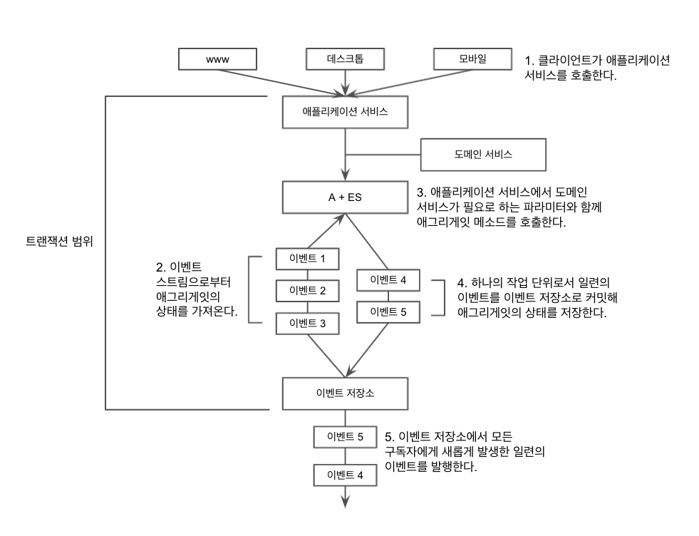

# 부록 A. 에그리게잇과 이벤트 소싱(A+ES)

이벤트 소싱은 애그리게잇을 생성한 이후 발생한 일련의 이벤틀르 통해 애그리게잇의 상태를 나타내는 데 사용할 수 있다.
이벤트가 발생한 순서대로 해당 이벤트를 다시 재생한다면, 이벤트를 통해 애그리게잇의 상태를 재구축할 수 있다.

언뜻 복잡해보이는데 왜 이걸 할까?

* 이벤트 소싱은 애그리게잇 인스턴스에 발생하는 각 변경의 발생 원인이 유실되지 않음을 보장한다.
  * 이는 곧 단기/장기 비즈니스 정보 수집, 분석 보고서, 전체 감사 로그, 디버깅 등에 활용된다.
* 이벤트 스트림은 수정이 없고 추가만 허용되기 때문에 성능이 매우 좋고 다양한 데이터 복제 옵션의 지원이 가능해진다.
* 이벤틀르 중심으로 애그리게잇을 설계하면 ORM의 잠재적인 임피던스 불일치를 회피해 유비쿼터스 언어로 표현되는 행동에 더욱 집중할 수 있다.
  * 이는 곧 견고하고 내결함성이 높은 시스템을 구축할 수 있도록 해준다.

물론 단점이 없는 것도 아니다.

* 이벤트를 정의하기 위해 비즈니스 도메인에 대한 깊은 이해가 필요하다.
* 경험한 개발자가 별로 없고 정보도 많이 없어서 경험이 부족한 팀은 높은 비용과 큰 리스크를 감수해야 한다.
* CQRS가 필수적이기 때문에 러닝커브가 생긴다.

## 애플리케이션 서비스의 내부



애플리케이션 서비스는 제어 요청(1)을 받으면 애그리게잇(2)과 해당 애그리게잇의 비즈니스 오퍼레이션에 필요한 도메인 서비스를 가져온다.
애플리케이션 서비스가 애그리게잇의 비즈니스 오퍼레이션을 수행하면(3) 애그리게잇의 메소드는 그 결과로 이벤트를 돌려준다.
이런 이벤트는 애그리게잇의 상태를 변경할 뿐 아니라, 해당 이벤트의 구독자에게 알림으로서 발행된다.
애그리게잇의 비즈니스 메소드에게 하나 이상의 도메인 서비스를 파라미터로 넘겨야 할 수도 있다.

```kotlin
class CustomerApplicationService {
  lateinit var eventStore: EventStore // 이벤트 저장소
  lateinit var pricingService: PricingService // 도메인 서비스
  
  // 위 그림의 1단계. lockForAccountOverDraft 가 호출된다. 
  fun lockForAccountOverDraft(customerId: CustomerId, comment: String) {
    // 2단계. 이벤트 스트림을 가져와서 애그리게잇을 구축한다.
    val stream = eventStore.loadEventStream(customerId)
    val customer = new Customer(stream.Events)
    
    // 3단계. 인수와 가격에 관한 도메인 서비스와 함께 애그리게잇의 메소드를 호출한다.
    customer.lockForAccountOverdraft(comment, pricingService)
    
    // 4단계. 주어진 ID의 변경을 이벤트 스트림으로 커밋한다.
    eventStore.appendToStream(customerId, stream.version, customer.changes)
  }
}
```

Event Stream은 다음과 같다.

```kotlin
interface EventStore {
  fun loadEventStream(id: Identity): EventStream
  
  fun loadEventStream(id: Identity, skipEvents: Int, maxCount: Int): EventStream
  
  fun appendToStream(id: Identity, expectedVersion: Int, events: Collection<Event>)
}

data class EventStream(val version: Int, val events: List<Event>)
```

`Customer`는 생성자에서 `events`를 받는데, 순서대로 이벤트를 `Customer#mutate()` 로 적용하여 애그리게잇의 상태를 재생한다.

```kotlin
// Customer 생성자 내부
events.forEach { event -> 
  mutate(event)
}
```

그렇다면 비즈니스 오퍼레이션은 어떻게 수행될까? `changes` 컬렉션에 누적된 후 애그리게잇의 현재 상태를 변경한다.

```kotlin
// Customer의 apply 메소드 - 이 메소드를 통해서만 협업하게 된다.
fun apply(event: Event) {
  changes.add(event)
  mutate(event)
} 
```

`changes` 는 반드시 이벤트 저장소로 커밋해야 한다. 어떻게 처리할 수 있을까?

간단하게는, 이벤트 스트림에 새로운 이벤트가 추가되면 publisher가 (이 이벤트에 관심있어하는)subscriber 들에게 발행한다.

좀 더 복잡하게는, Write through 전략으로 replication 이벤트 저장소를 두어서 다음과 같이 처리한다.

1. 애그리게잇이 이벤트를 master event store에 저장한다.
2. master event store에서 이벤트가 replication event store로 복제된다.
3. 복제본이 수신되면 master event store가 알게 된다.
4. master event store가 `append()` 호출을 완료한다.

복제본을 두었기 떄문에 결함 내구성을 증가시킨다.

저장되고 나서 복제하는 방법으로 Write behind 전략이 있다.

1. 애그리게잇이 이벤트를 master event store에 저장한다.
2. master event store 는 `append()` 를 곧바로 호출한다.
3. 이후 master event store가 이벤트를 replication event store에 저장한다.

지금까지 내용에서 뼈대를 정리해보자면 다음과 같다.

1. 클라이언트가 애플리케이션 서비스의 메소드를 호출한다.
2. 비즈니스 오퍼레이션을 수행하기 위해 필요한 도메인 서비스를 획득한다.
3. 클라이언트가 제공하는 애그리게잇 인스턴스 식별자에 해당하는 이벤트 스트림을 가져온다.
4. 스트림의 모든 이벤트를 적용해 애그리게잇 인스턴스를 재구축한다.
5. 인터페이스 계약에 따라 필요한 모든 매개변수를 넘기며 애그리게잇이 제공하는 비즈니스 오퍼레이션을 실행한다.
6. 애그리게잇은 도메인 서비스나 다른 애그리게잇의 인스턴스 등으로 더블 디스패치 될 수 있으며, 해당 오퍼레이션의 결과로서 새로운 이벤트가 생성된다.
7. 비즈니스 오퍼레이션의 실패가 없다는 가정 하에서, 동시성 충돌을 피하기 위해 새롭게 생성된 모든 이벤트를 스트림 버전을 사용해 이벤트 스트림에 추가한다.
8. 메시징 인프라를 통해 이벤트 저장소에 새롭게 추가된 이벤트를 구독자에게 발송한다.

이 뼈대에 살을 붙이는 것은 커맨드 핸들러와 람다이다.

## 커맨드 핸들러

```kotlin
class CustomerApplicationService {
  ...
  fun lockCustomer(id: CustomerId, reason: String) {
    val eventStream = eventStore.loadEventStream(id)
    val customer = Customer(stream.events)
    customer.lockCustomer(reason)
    eventStore.appendToStream(id, eventStream.version, customer.changes)
  }
  
  fun lockCustomer(reason: String) {
    if (!consumptionLocked) { // mutate 중이 아니라면
      apply(CustomerLocked(state.id, reason);
    }
  }
  ...
}
```

위 코드를 커맨드를 써서 리팩토링 해보자.

```kotlin
data class LockCustomerCommand(val customerId: CustomerId, val reason: String)
```

커맨드는 의미적으로 이벤트와 동일하며 시스템 전반에서 사용될 수 있다.

```kotlin
class CustomerApplicationService {
  ...
  fun when(command: LockCustomerCommand) {
    val eventStream = eventStore.loadEventStream(command.customerId)
    val customer = Customer(stream.events)
    customer.lockCustomer(command.reason)
    eventStore.appendToStream(id, eventStream.version, customer.changes)
  }
  ...
}
```

아주 단순한 리펙토링이지만 1. 로드 벨런싱을 통해 성능을 개선할 수 있고, 2. 시스템의 가용성을 높이고 3. 추가적인 aspect를 묶어 처리할 수 있다는 점에서 시스템에 장기적인 이익을 가져다준다.

`LockCustomerCommand`는 직렬화 될 수 있기 때문에 메시지 큐를 통해 메시지로 보낼 수 있다. 이를 통해 클라이언트와 서비스 사이의 결합이 분리되면
로드벨런싱을 개선하고 시스템 파티셔닝을 지원할 수 있다. 즉 메시지 큐에 들어온 커맨드들을 여러 서버가 라운드 로빈같은 방식으로 돌아가면서 처리할 수 있게 된다.

성능 개선 뿐만 아니라 서비스의 가용성도 높여준다. 예를 들어 서버가 죽는다고 해도, 메시지 큐에 커맨드가 계속 쌓이고, 나중에 서버가 복원되면 그 때부터 다시 처리하는 방식을 생각해볼 수 있다.

## 람다 구문

```kotlin
class CusomerApplicationService {
  ...
  fun update(id: CustomerId, execute: (customer) -> Unit)) {
    val eventStream = eventStore.loadEventStream(id)
    val customer = Customer(eventStream.events)
    execute(customer)
    eventStore.appendToStream(id, eventStream.version, customer.changes)
  }
}
```

여기서 `execute`는 익명 함수를 표현한다.

```kotlin
fun when (customer: LockCustomer) {
  update(customer.id) { customer -> customer.lockCustomer(customer.reason) }
}
```

> 음 이건 왜 쓰는 지 잘 모르겠다.

## 동시성 제어

애그리게잇의 이벤트 스트림은 여러 스레드가 동시에 접근하고 읽을 수 있다.

1. 스레드 1이 애그리게잇 생성을 위해 이벤트 1~3 을 가져온다.
2. 스레드 2가 애그리게잇 생성을 위해 이벤트 1~3 을 가져온다.
3. 스레드 1이 행동을 실행하여 이벤트 4~5를 추가한다.
4. 스레드 2가 행동을 실행하여 이벤트 4~5를 추가하려고 하지만 이미 존재하기 때문에 실패한다.

가장 간단한 해결책은 `EventStoreConcurrencyException`을 던져서 클라이언트가 재시도하게 만드는 것.

retry를 하려고 한다면?

1. 스레드 1이 애그리게잇 생성을 위해 이벤트 1~3 을 가져온다.
2. 스레드 2가 애그리게잇 생성을 위해 이벤트 1~3 을 가져온다.
3. 스레드 1이 행동을 실행하여 이벤트 4~5를 추가한다.
4. 스레드 2가 행동을 실행하여 이벤트 4~5를 추가하려고 하지만 이미 존재하기 때문에 `EventStoreConcurrencyException` 을 던진다.
5. 재시도 과정에서 애그리게잇 다시 생성을 위해 이벤트 1~5를 가져온다.
6. 스레드 2가 재실행을 성공하여 이벤트 6~7이 추가된다.

동시성 예외의 실제 발생 횟수를 감소시킬 순 없을까?

이벤트 타입이 서로 다르다면 충돌이 발생하지 않는 것으로 생각할 수 있다.

```kotlin
fun conflictsWith(event1: Event, event2: Event): boolean {
  return event1.type == event2.type
}
```

위와 같이 `conflictsWith` 를 애그리게잇마다 구현해두고,

1. 스레드 1이 애그리게잇 생성을 위해 이벤트 1~3 을 가져온다.
2. 스레드 2가 애그리게잇 생성을 위해 이벤트 1~3 을 가져온다.
3. 스레드 1이 행동을 실행하여 이벤트 4~5를 추가한다.
4. 스레드 2가 행동을 실행하여 이벤트 4~5를 추가하려고 하지만 이미 존재하기 때문에 `EventStoreConcurrencyException`을 던진다. `EventStoreConcurrencyException` 에는 이벤트 store에 이미 저장돼있는 이벤트들이 포함된다. 
5. 예외를 처리하면서 실패한 이벤트들 모두가 이벤트 저장소에 있던 이벤트들과 `conflictsWith == false` 라면 바로 저장해버린다.
6. 그렇지 않다면 재시도 과정에서 애그리게잇 다시 생성을 위해 이벤트 1~5를 가져온다.
7. 스레드 2가 재실행을 성공하여 이벤트 6~7이 추가된다.

## A+ES의 구조적 자유

A+ES의 실질적 이점 중 하나는 영속성의 간결함과 다양한 유용성이다. 애그리게잇이 얼마나 복잡하든 상관없이 이벤트가 죽 나열된 eventStream 으로 표현될 수 있다.
도메인이 진화하면서 애그리게잇의 구조가 변경되어도 이러한 변경을 어렵지 않게 감당할 수 있다.

특정된 식별자를 갖고 있는 일련의 이벤트를 event stream 이라고 하는데, 오직 추가만 가능하다. 이 스트림은 강력한 일관성이 보장되기만 한다면 어디든(RDB, NoSQL, File system, Cloud ...) 저장될 수 있다.
3가지 이점은 다음과 같다.

* 도메인 전문가가 제시하는 새로운 행동을 담아내기 위해 필요한 구조적 표현을 애그리게잇의 내부 구현에 적용할 수 있도록 해준다.
* 여러 호스팅 솔루션 사잉에서 전체 인프라를 옮길 수 있도록 해서, 클라우드에 발생한 문제를 처리하고 효과적으로 패일오버할 방법을 제공해준다.
* 오류 조건을 디버깅하기 위해 개발 장비로 애그리게잇 인스턴스의 이벤트 스트림을 다운로드해서 다시 재생할 수 있도록 해준다.

## 성능

애그리게잇의 Id로 조회한 개별 event stream 사이즈가 수백 - 수천개가 넘는다면 성능 문제가 발생할 수 있다.
성능 문제를 해결하기 위해 각 애그리게잇 인스턴스의 스냅샷을 만들어서 이벤트 스트림을 다시 재생할 때 최신 스냅샷 + 그 이후에 발생한 이벤트를 재생한다.

스냅샷은 단순히 인터페이스를 통한 캡슐화를 활용해 리포지토리로 저장할 수 있다.

```kotlin
interface SnapshotRepository {
  fun <AggregateType> tryGetSnapshotById(id: Identity): Pair<AggregateType, Int>? // 리턴값 pair.second는 스냅샷 버전. 
  fun <AggregateType> saveSnapshot(id: Identity, snapshot: AggregateType, version: Int)
}
```

스냅샷을 저장할 떄는 반드시 스트림 버전을 함께 기록해야 한다. 그 버전으로 스냅샷과 스냅샷을 기록한 시점 이후에 발생한 이벤트를 가져와야 하기 때문이다.

먼저 애그리게잇을 스냅샷으로부터 재생하는 걸 살펴보자.

```kotlin
fun loadCustomerAggregateById(id: CustomerId) {
  val loaded = snaphostRepository.tryGetSnapshotById<Customer>(id)
  if (loaded == null) {
    // 저장된 스냅샷이 없으면 그냥 저장돼있는 이벤트 가져와서 재생한다.
    return Customer(eventStore.loadEventStream(id).events)
  }
  
  val snapshotVersion = loaded.second
  // 스냅샷을 만든 시점 이후의 모든 이벤트를 가져온다.
  val stream = eventStore.loadEventStreamAfterVersion(id, snapshotVersion)
  val customer = loaded.first
  customer.replayEvents(stream.events)
  return customer
}
```

스냅샷을 생성하는 것도 복잡하지 않다. 

```kotlin
fun generateSnapshotForCustomer(id: Identity) {
  val stream = eventStore.loadEventStream(id)
  val customer = Customer(stream.events)
  snapshotRepository.save(id, customer, stream.version)
}
```

스냅샷의 생성과 저장은 백그라운드 스레드로 위임할 수 있다. 새로운 스냅샷은 마지막 스냅샷을 만든 이후 지정된 수의 이벤트가 발생했을 때만 생성한다.

## 이벤트 저장소의 구현

위에서 미리 살펴봤던 인터페이스를 다시 가져와봤다.

```kotlin
interface EventStore {
  // 모든 이벤트를 가져온 stream
  fun loadEventStream(id: Identity): EventStream
  
  // 이벤트 중 일부를 가져온 stream
  fun loadEventStream(id: Identity, skipEvents: Int, maxCount: Int): EventStream
  
  // expectedVersion이 충돌하면 OptimisticConcurrencyException 예외를 던진다.
  fun appendToStream(id: Identity, expectedVersion: Int, events: Collection<Event>)
}

data class EventStream(val version: Int, val events: List<Event>)
```

## 관계형으로 저장하기

MySQL을 쓰는 상황에서 먼저 이벤트 저장소 스키마를 만들어 보자.

```
CREATE TABLE IF NOT EXISTS `ES_EVENTS` (
  `Id` int NOT NULL AUTO_INCREMENT, -- 고유 식별자
  `Name` nvarchar(50) NOT NULL, -- 스트림의 이름
  `Version` int NOT NULL, -- 증가되는 스트림의 버전
  `Data` LONGBLOB NOT NULL -- 데이터 페이로드
)
```

트랜잭션 안에서 이벤트를 특정 스트림에 추가하려면:

1. 트랜잭션을 시작한다.
   ```kotlin
   conn.beginTransaction()
   ```
2. 이벤트 저장소에 변경이 발생해 예상했던 버전과 맞지 않는다면 예외를 던진다.
   ```
   SELECT COALESCE(MAX(Version), 0) FROM `ES_EVENTS` WHERE Name = $name;
   ```
3. 동시성 충돌이 발생하지 않는다면 이벤트를 추가한다.
   ```
   INSERT INTO `ES_EVENTS` (`Name`, `Version`, `Data`) VALUES($name, $version, $data);
   ```
5. 트랜잭션을 커밋한다.
   ```kotlin
   tx.commit()
   ```

## 블롭으로 저장하기

DB를 안쓰고 BLOB이나 FS를 쓰는 방식인데, 거의 쓸 일 없을 것 같아서 스킵한다.

## 집중된 애그리게잇

이벤트 소싱을 하지 않고 애그리게잇을 개발하게 되면 시스템에 새로운 엔티티를 도입할 때의 개발 부담이 커지거나 기존 시스템을 강화하는 과정이 어려워질 수 있다.
새로운 테이블을 생성하고 매핑 스키마와 리포지토리 메소드를 정의해야 한다.
비용이 너무 큰 이 작업을 하기 싫어서 도피하다보면 새로운 애그리게잇을 추가하기 보다 원래 있던 애그리게잇에 추가하다가 점점 애그리게잇이 뚱뚱해진다.

A+ES를 사용하면 애그리게잇을 더 작게 유지하는 것이 쉽다.

엄청나게 큰 고가용성(매초마다 수천 개의 메시지를 처이해야 한다거나)이 요구되는 애그리게잇도 자동으로 확장 가능한 클라우드에 저장을 해서 쉽게 처리할 수 있다.

> 도메인 모델링을 시작할 땐 들어올 커맨드와 나갈 이벤틀르 먼저 정의하고 그에 따라 수행되는 행동을 정의함으로써 유비쿼터스 언어의 중심을 만드는 편이 도움이 될 수 있다.
> 그 이후에 유사성과 관련성과 비즈니스 규칙을 기준으로 그중 일부 개념을 묶어서 애그리게잇을 만들게 된다. 이런 접근을 취한다면 핵심 비즈니스 개념에 관해 더욱 깊게 이해할 수 있게 된다.

## 읽기 모델 투영(Read Model Projection)

지금까지 ID로만 애그리게잇을 가져왔는데, 애그리게잇의 속성을 이용해서 쿼리해야 한다면 어떨까? 이럴 땐 Read Model Projection 을 사용한다.

Read Model Projection 은 읽기 모델을 생성하고 갱신하기 위해 사용되는 단순한 도메인 이벤트 구독자의 집합이다. 이벤트 구독자가 새로운 이벤트를 수신하면
일부 쿼리 결과를 게산하고 추후 사용을 위해 결과를 read model에 저장한다.

```kotlin
class CustomerTransactionsProjection { // 고객의 거래 내역이 알고 싶다면?
  lateinit var projectionStrore: DocumentWriter<CustomerId, CustomerTransactions>
  // 새로운 이벤트 처리할 때마다 관심있는 정보들: 거래액 총합, 평균, 내역들 을 업데이트 한다.
}
```

`CustomerTransactions`라는 읽기 모델은 직렬화되어 저장소로 저장되는 DTO 다.

읽기 모델은 문서 데이터베이스에 저장하는 경우가 일반적이지만, 메모리에 케싱하거나 RDB로 저장할 수도 있다.

읽기 모델이 수정되는 경우, 기존 읽기 모델 데이터를 모두 버린 후, Projection 클래스를 통해 전체 이벤트 스트림을 다시 실행해서 새로운 데이터를 생성하면 된다.

## 애그리게잇 설계와 함께 사용하기

Read Model Projection은 비단 클라이언트 뿐만 아니라 바운디드 컨텍스트와 그에 속한 애그리게잇 끼리 정보를 공유할 때도 유용하다.

Projection은 느슨하게 결합되기 때문에 애그리게잇 수정 없이도 Projection 로직을 변경해 언제든지 읽기 모델을 재구축할 수 있다.

## 이벤트 강화

프로젝트 관리 시스템의 요구사항이 다음과 같다고 하자.

* 고객이 새로운 프로젝트를 생성한다.
* 고객이 완료된 프로젝트를 보관한다.
* 고객이 프로젝트 이름을 변경한다.
* ...

완료된 프로젝트를 보관할 떄 `ProjectArchived`이벤트가 발생한다고 하자.

```kotlin
data class ProjectArchived(
  val id: ProjectId,
  val changeAuthorId: UserId,
  val archivedUtc: DateTime,
  val optionalComment: String
)
```

read model에서는 프로젝트 생성, 프로젝트 이름 변경, 프로젝트 보관, 프로젝트 할당, 프로젝트 할당 취소 등의 이벤트 마다 투영(Projection)이 발생하고 이에 따라 `ArchivedProjectsPerCustomerView`를 생성하거나 갱신한다.

그러나 항상 모든 이벤트를 받아서 Projection해주어야 할까? 이벤트를 강화해서 한 가지 이벤트만 받도록 하면 어떨까?

```kotlin
// Projection에 필요한 필드들을 추가.
data class ProjectArchived(
  val id: ProjectId,
  val changeAuthorId: UserId,
  val archivedUtc: DateTime,
  val optionalComment: String,
  val customerId: CustomerId,
  val customerName: CustomerName
)
```

상당한 수의 구독자가 필요 이상의 정보를 갖게 되더라도 80퍼센트의 구독자를 만족시키기에 충분한 정보를 포함하도록 설게하라.

## 지원 도구와 패턴

A+ES의 개발 빌드 배포의 과정을 지원하는 도구가 있을까?

### 이벤트 직렬화기(Serializer)

이벤트의 버전관리와 이름변경이 쉬운 Serializer를 선택해야 한다. 프로토콜 버퍼가 괜찮다.

### 이벤트 불변성

이벤트 스트림은 불변성을 가지고 있다. 이벤트를 설계할 때 외부에서 set을 하지 못하도록 두자.

### 값 객체

그냥 VO는 굉장히 좋고, A+ES와도 잘맞는다는 이야기. 이미 6장에서 대부분 논의된 내용이다.

## 계약 생성

수백 개의 이벤트/커맨드 계약에 해당하는 정의를 보통 (프로토콜 버퍼의 .proto 같은)DSL(Domain Specific Language)로 표현한다. 

이로 인한 이점은:

* 도메인 모델링 이터레이션을 가속시켜서 개발 마찰을 줄여준다.
* 수동 작업에서 흔하게 발생하는 휴먼 에러를 줄여준다.
* 간결한 표현에 따라 한 화면 안에서 전체 이벤트 정의를 볼 수 있어 큰 그림을 제공해준다. 유비쿼터스의 간결한 용어집이 되기도 한다.
* 소스나 바이너리 코드가 없어도 간결한 정의로서 이벤트 계약에 버전을 부여해 배포할 수 있다.

## 단위 테스트와 명세

이벤트 소싱과 단위 테스트도 궁합이 좋다. 이벤트가 발생하면 애그리게잇의 상태가 변경되고, 우리는 그 상태를 테스트하면 된다.

* given: 이벤트가 과거에 발생하면
* when: 메소드가 호출되면서
* then: 이벤트가 이어지거나 예외가 발생한다

Event sourcing specification 을 검색해보는 것도 도움이 된다.

## 함수형 언어에서의 이벤트 소싱

이벤트 소싱은 태생적으로 함수형이다. 따라서 함수형 언어로도 성공적인 구현이 가능하다.
