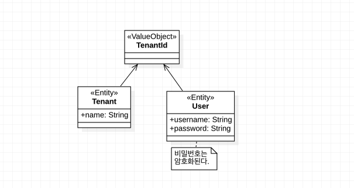
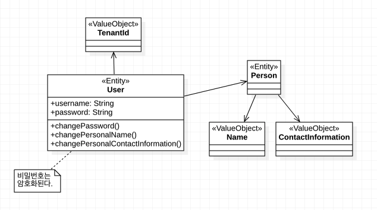

# 5장. 엔티티

드디어 전술적 설계로 넘어왔다!

## 엔티티를 사용하는 이유

한 개념을 시스템 내의 다른 객체와 반드시 구분해야 한다면 엔티티로 설계한다. 즉, 고유 식별자(Unique Id)와 변경 가능성(Mutability)가 Value Object 와
Entity 사이의 차이점이다.

## 고유 식별자

고유 식별자를 생성하고 할당하는 순서를 고려해야 하는데, 크게 2가지 방식이 있다.

* 빠른 식별자 생성과 할당은 엔티티가 저장되기 전에 일어난다.
* 늦은 식별자 생성과 할당은 엔티티가 저장될 때 일어난다.

고유 식별자를 얻기 위한 전략으로는 여러가지가 있는데, 하나씩 알아가보자.

### 사용자가 식별자를 제공한다

Forum 이나 Discussion의 식별자로 제목을 선정하는 경우다. 사용자는 이 값을 바꾸고 싶어할 텐데, Entity에서 ID는 바뀌지 않는다.
따라서 사용자의 입력값은 엔티티 ID로 부적절하다.

### 애플리케이션이 식별자를 생성한다

UUID(Universally Unique Identifier)나 GUID(Globally Unique Identifier) 를 사용하는 방법이다.

장점은 다음과 같다.

* 외부(영속성 메커니즘)와의 교류가 필요하지 않다.
* 식별자 생성이 매우 빠르다
* 빠른 식별자 생성이 가능하다.

단점은 다음과 같다.

* 충돌 가능성이 있다.
* 충돌 가능성을 0에 가깝게 만들기 위해 긴 바이트의 ID를 생성하면 메모리 부담이 발생한다.

애플리케이션에서 식별자를 생성한다고 하더라도, 리포지토리를 통해 구현하는 편이 좋다. 

```java
public class HibernateProductRepository implements ProductRepository {
  ...
  public ProductId nextIdentity() {
    return new ProductId(UUID.randomUUID().toString().toUpperCase());
  }
}
```

### 영속성 메커니즘이 식별자를 생성한다

고유 식별자의 생성을 영속성 메커니즘에게 위임하는 방법이다.

장점은 다음과 같다.

* 충돌가능성이 0이다.

단점은 다음과 같다.

* 값을 얻기 위해 DB까지 접근해야 하므로 성능 문제가 생긴다.
* 빠른 식별자 생성을 지원하기 위해 별도의 쿼리가 필요하다.

```java
public ProduictId nextIdentity() {
  Long rawProductId = (Long) this.session()
    .createSQLQuery("SELECT product_seq.nextval as product_id from dual")
    .addScaler("product_id", Hibernate.LONG)
    .uniqueResult();
    
  return new ProductId(rawProductid);
}
```

만약 빠른 식별자 생성을 원한다면,

```java
public ProduictId nextIdentity() {
  long rawId = -1L;
  try {
    PreparedStatement ps = this.connection()
        .prepareStatement("UPDATE product_seq SET next_val=LAST_INSERT_ID(next_val + 1)");
    
    ResultSet rs = ps.executeQuery();
    
    try {
      rs.next();
      rawId = rs.getLong(1);
    } finally {
      try {
        rs.close();
      } catch(Throwable t) {} // Ignore.
    }
  } catch (Throwable t) {
    throw new IllegalStateException("Cannot generate next identity", t);
  }
  
  return new ProductId(rawId);
}
```

### 또 하나의 바운디드 컨텍스트가 식별자를 할당한다

이 방법은 식별자 생성 전략 중에서 가장 복잡하다. 이벤트 주도 아키텍처를 도메인 이벤트와 함께 사용해야 하기 때문이다.
로컬 바운디드 컨텍스트는 외부 시스템이 게시한 도메인 이벤트를 구독하고, 이에 관한 알림을 받으면 로컬 시스템은 고유 애그리게잇 엔티티의 상태를 바꿔서 외부
시스템의 엔티티 상태를 반영한다. 경우에 따라서는 로컬 바운디드 컨텍스트가 반드시 외부 시스템에게 변경 내용을 푸시하며 동기화를 시작해야 할 때도 있다.

> 결론은 비추천.

### 식별자 생성의 시점이 문제가 될 때

엔티티가 저장될 때까지 식별자 생성이 지연되면 발생할 수 있는 문제점이 2가지 있다.

* 외부에서 도메인 이벤트를 구독하고 있는 경우
    * 도메인 이벤트를 초기화하려면 식별자가 필요한데, 영속화되기 전이라서 식별자도 없는 상황이다.
      식별자 없이 발행을 하더라도 영속화와 외부의 도메인 이벤트 구독 사이에 race condition이 발생한다. 

* 영속화 되기 전 엔티티를 서로 비교할 수 없다.
    * 이를 피하기 위해 Value Object 처럼 속성으로 비교하도록 `equals()`를 구현하는 방법이 있으나 별로 권장되진 않는다.

### 대리 식별자(Surrogate identity)

ORM이 알아서 관리하도록 Long이나 Int 타입의 Auto increment한 Id 속성을 제공해주고, 도메인 레벨에서는 따로 키를 만들어서 사용하는 방법이다.

```java
public abstract class IdentifiedDomainObject implements Serializable {
  private long id = -1;
  
  public IdentifiedDomainObject() {
    super();
  }
  
  private long id() { // private 가시성으로 외부 세계로의 노출을 막는다.
    return this.id;
  }
  
  private void setId(long anId) {
    this.id = anId;
  }
}
```

즉, 도메인 ID가 데이터베이스의 기본키가 되지 않도록 하고, 위 추상 클래스의 `id`가 데이터베이스의 기본 키가 된다.

### 식별자 안전성

식별자는 수정되지 못하도록 보호되고, 할당된 엔티티의 수명주기에 걸쳐 안정적으로 유지되어야 한다.

## 엔티티의 발견과 그들의 내부적인 특성

단순히 클래스에 이름 붙여줄 명사와 중요한 오퍼레이션의 이름으로 쓰일 동사의 집함만을 객체에서 뽑아낸다고 생각하는 것은 모델이 가져야 하는
유창함과 풍부함을 억누른다. 생각, 노력, 동의, 합의가 녹아든 언어를 개발하고, 완전한 문장으로 언어를 말하게 될 때 모델은 이야기 되는 언어를 분명히 반영한다.

### 엔티티와 속성을 알아내기

아래 한 가지 요구 사항만 가지고 코딩에 들어갔다가는 에너믹 모델을 만든다.

* 사용자는 테넌시와 관련이 있고 테너시의 제어를 받는다.

토론을 계속한 후에 단어를 만들고 요구사항에 더 많은 의미를 부여해야 한다. 아래처럼.

* 테넌트는 초대를 통한 많은 사용자의 등록을 허용한다.
* 테넌트는 활성화될 수 있고, 비활성화 될 수도 있다.
* 시스템의 사용자는 반드시 인증돼야 하지만, 테넌트가 활성화된 경우에만 인증이 가능하다.

벌써 `Tenant` 와 `User` 라는 두 엔티티 모델을 찾았다.



`User`는 `Tenant`안에서만 고유하면 되기 때문에 알아서 `username`을 고유하게 설정하도록 했다.

유비쿼터스 용어집도 만들었다:

* 테넌트: 식별자와 액세스 버시스와 그 밖의 다른 온라인 서비스의 명명된 조직적 구독자. 초대를 통해 사용자를 등록하도록 도와준다.
* 사용자: 테넌시 내에 등록된 보안 주체로, 개인의 이름과 연락처 정보를 포함해 만들어진다. 사용자는 고유 사용자명과 암호화된 비밀번호를 갖게 된다.
* 암호화 서비스: 일반 텍스트로 저장하거나 사용할 수 없도록 암호화된 암호나 기타 데이터를 암호화하는 방법을 제공한다.

### 필수 행동 파헤치기

* 테넌트는 활성화될 수 있고, 비활성화 될 수도 있다.

이걸 아래처럼 표현한다고 해서 본래의 의도를 제대로 나타내고, 읽는 사람에게 항상 유용한 내용을 전달할까?

```java
public class Tenant extends Entity {
  ...
  private boolean active;
  ...
}
```

댓츠 노노 그렇지 않다.

```java
public class Tenant extends Entity {
  ...
  public void activate() {}
  public void deactivate() {}
  ...
}
```

`setActive(boolean)`보다는 훨씬 낫다. 나중에 세부사항이 더 구현되어 표현력이 풍부해질 수도 있을 것이다. 테스트를 위해 `isActive()`도 추가하고 사용자를
등록하기 위해 `registerUser()` 메소드도 추가했다. `registerUser`는 무언가 Invitation 객체가 필요할 것처럼 보이지만, 아직은 이해가 부족하여 넘어가기로 한다.

유비쿼터스 용어집이 업데이트 되었다:

* 테넌트 활성화: 이 오퍼레이션을 통해 테넌트를 활성화하고, 현재 상태를 확인할 수 있다.
* 테넌트 비활성화: 이 오퍼레이션을 통해 테넌트를 비활성화한다. 테넌트가 비활성화됐을 땐 사용자를 인증하지 못할 수 있다.
* 인증 서비스: 먼저 테넌트가 활성화돼 있음을 확인한 후 사용자의 인증 여부를 조정한다. // 새로운 도메인 서비스(`AuthenticationService`)를 발견했다!

사용자를 좀 더 보자.

* 사용자는 이름과 연락처를 비록한 개인 정보를 가지고 있다. // 개인 이라는 단어가 등장했다. 새로운 엔티티로 추가할까?
* 사용자의 개인 정보는 사용자나 관리자에 의해 변경될 수 있다.
* 사용자의 보안 인증(비밀번호)는 변경될 수 있다.



`User` 가 반드시 사람일까? 시스템일 수는 없을까? `Person`이 사실 애매하긴 하지만, 나중에 리팩토링될 것이다.

이벤트가 필요할지도 모른다.

1. 이벤트는 모든 객체의 수명주기에 걸쳐 변화를 추적할 수 있도록 해준다.
2. 외부 구독자가 변경에 맞춰 동기화할 수 있도록 해주고, 이는 외부자에게 자율성의 잠재력을 부여한다.

### 역할과 책임

인터페이스는 구현 클래스의 역할을 결정한다. 명시적으로 인터페이스가 없더라도 클래스의 public method는 결국 인터페이스 이므로 `User`는 `User`라는 역할을 수행한다.
인터페이스를 역할별로 선언하는 것을 선언하든, 하나의 엔티티에 합쳐버리는것을 선호하든, 유비쿼터스 언어가 항상 우위에 서있도록 해야 한다. DDD에서는 비즈니스 도메인의 모델이 가장 중요하다.

### 생성

새로운 엔티티를 인스턴스화할 때, 이를 완전히 식별해 클라이언트가 찾을 수 있도록 충분한 상태 정보를 포착하는 생성자를 선언하는 것이 좋다.
이름이나 설명과 같은 다른 수단으로도 쿼리된다면 그 모든 사항도 생성자의 매개변수로 포함시킨다.

```java
public class User extends Entity {
  ...
  protected User(TenantId aTenantId, String aUsername, String aPassword, Person aPerson) {
    this();
    this.setPassword(aPassword);
    this.setPerson(aPserson);
    this.setTenantId(aTenantId);
    this.setUsername(aUsername);
    this.initialize();
  }
  ...
  protected void setPassword(String aPassword) {
    if (aPassword == null) {
      throw new IllegalArgumentException("The password may not be set to null.");
    }
    this.password = aPassword;
  }
  
  protected void setUsername(String aUsername) {
    if (this.username != null) {
      throw new IllegalArgumentException("The username may not be changed.");
    }
    
    if (aUsername == null) {
      throw new IllegalArgumentException("The username may not be set to null.");
    }

    this.username = aUsername;
  }
  ...
}
```

`Tenant` 의 `registerUser`는 팩토리처럼 동작한다.

```java
public class Tenant extends Entity {
  ...
  protected User registerUser(String aUsername, String aPassword, Person aPerson) {
    User user = new User(this.tenantId(), aUsername, aPassword, aPerson);
    return user;
  }
}
```

### 유효성 검사

모델 내부의 3단계에 걸친 유효성 검사를 살펴보자.

* 특성/속성의 유효성 검사
  
    * 위 `User` 처럼 각 속성을 검사하는 것을 말한다: Self-encapsulation.
    * 유효성 검사는 도메인 객체가 아닌 유효성 검사 클래스의 책임이어야 하지 않느냐? - 여기서는 계약에 의한 설계 접근법에서의 assertion 이다.

* 전체 객체의 유효성 검사
  
    * 전체 객체를 검사하는 것을 말한다.
    * 완전히 유효한 특성들로 뭉쳤다고 해도, 전체 객체에서 바라보았을 때 유효하지 않을 수 있다.
    * 많은 경우 도메인 객체의 유효성 검사는 도메인 객체 자체보다 더 자주 변경된다. 따라서 엔티티 내부에 휴요성 검사를 집어넣으면 SRP를 위반한다.
    * 유효성 검사 클래스는 명세 패턴이나 전략 패턴을 구현할 수 있다.
    * `abstract class Entity`안에 `validate()` 추상 메소드를 넣어서 유효성 검사가 필요한 엔티티가 호출할 수 있게 한다. 

* 객체 컴포지션의 유효성 검사

    * 여러 엔티티의 클러스터(애그리게잇 혹은 애그리게잇의 집합체)에 대해 검사하는 것을 말한다.
    * 도메인 서비스를 사용하는 편이 최선일 수 있다.
    * 리포지토리로부터 애그리게잇을 읽어와서 validation한다.
    * 상황에 따라 애그리게잇이나 애그리게잇의 집합체는 일관성이 보장되지 않는 어정쩡한 상태일 수 있다. 이 경우 도메인 이벤트를 활용해서 온전한 상태일 때
    validate를 하도록 구현할 수도 있다.

## 변화 추적

가장 실용적인 변경 추적은 이벤트 저장소와 도메인 이벤트에 의해 이루어진다: 이벤트 소싱
