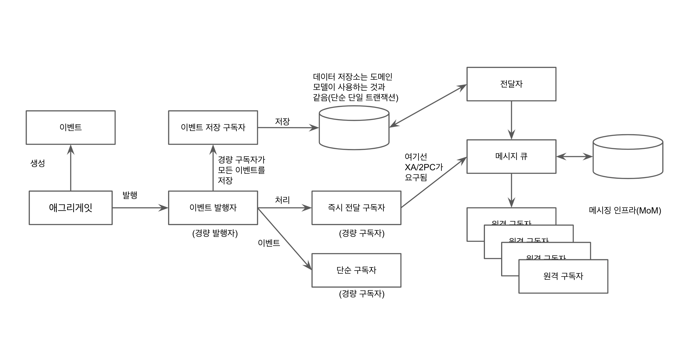

# 8장. 도메인 이벤트

도메인에서 발생한 사건을 포착하기 위해 도메인 이벤트를 사용하자. (주의: 이벤트는 도메인을 아우른다. 한 바운디드 컨텍스트에만 해당되는 내용이 아니다)

## 언제 그리고 왜 도메인 이벤트를 사용할까

도메인 전문가가 다음과 같은 말을 할때다.

* "~할 때"
* "그런 일이 일어나면 ~"
* "~하면 저한테 알려주세요"
* "~한 일의 발생"

도메인 전문가가 모든 종류의 이벤트를 다 알진 못할 수도 있다. 외부의 바운디드 컨텍스트로의 브로드캐스팅 같은 경우가 그러하다.
이런 이벤트와 관련된 논의에 반드시 도메인 전문가와 참여하고, 공감대를 형성하게 되면 새로운 이벤트는 유비쿼터스 언어에 포함된다.

언제 사용하는지는 알았다. 그럼 **왜** 사용할까?

이벤트는 보통 Eventual consistency 를 위해 사용된다. 이는 글로벌 트랜잭션의 필요성을 제거하고, 애그리게잇의 규칙을 지원한다.
애그리게잇의 규칙 중에서는 트랜잭션에서 단 하나의 인스턴스 만이 변경돼야 하고, 다른 모든 종속적 변경은 별도의 트랜잭션에서 일어나야 한다는 규칙이 있다.
즉, 이 때 이벤트가 참여하여 로컬 바운디드 컨텍스트의 다른 애그리게잇이 동기화될 수 있도록 한다. 이런 결합 분리는 높은 확장성과 협업하는 서비스 집합의
최고 성능을 제공하는 데 도움이 된다. 또한 이를 통해 시스템 간의 느슨한 결합을 달성할 수 있다.

아래는 개괄적인 그림으로, 이벤트가 로컬, 외부, 바운디드 컨텍스트에 의해 소비되는 모습을 보여준다.



그림에서 보이는 것처럼 이벤트를 생성하고 발행하는 주체는 애그리게잇이다. 구독자는 이벤트를 저장한 후 원격 구독자에게 전달하거나,
저장하지 않고 전달한다. 메시징 미들웨어가 모델의 데이터 저장소를 공유하지 않는 한, 즉시 전달에는 글로벌 트랜잭션(XA)이나 두 단계 커밋(2 phase commit)이 필요하다.

## 이벤트의 모델링

이벤트 이름은 애그리게잇 상에 무슨 일이 일어났는지를 표현해야 하기 때문에 과거형으로 나타낸다.

속성으로는 어떤 것이 필요할까?

* 이벤트가 언제 일어났는지 나타내는 타임스탬프가 필요하다.
* 보통 이벤트를 발행한 에그리게잇의 ID 를 포함한다.
* 이벤트 처리에 필요한 정보들을 담는다.

예시로는 다음과 같다.

```java
public interface DomainEvent {
  public Date occurredOn();
}

public class BacklogItemCommitted implements DomainEvent {

    private BacklogItemId backlogItemId;
    private SprintId committedToSprintId;
    private int eventVersion;
    private Date occurredOn;
    private TenantId tenantId;

    public BacklogItemCommitted(TenantId aTenantId, BacklogItemId aBacklogItemId, SprintId aCommittedToSprintId) {
        super();

        this.backlogItemId = aBacklogItemId;
        this.committedToSprintId = aCommittedToSprintId;
        this.eventVersion = 1;
        this.occurredOn = new Date();
        this.tenantId = aTenantId;
    }

    public BacklogItemId backlogItemId() {
        return this.backlogItemId;
    }

    public SprintId committedToSprintId() {
        return this.committedToSprintId;
    }

    @Override
    public int eventVersion() {
        return this.eventVersion;
    }

    @Override
    public Date occurredOn() {
        return this.occurredOn;
    }

    public TenantId tenantId() {
        return this.tenantId;
    }
    
    public SprintId sprintId() {
        return this.committedToSprintId;
    }
}
```

이 이벤트를 구독하고 처리하는 시점에서 일관성을 갖게 된다.

```java
// MessageConsumer 로부터 Message를 받아왔다고 가정.
@Override
public void handleMessage(event: BacklogItemCommitted) {
  Sprint sprint = sprintRepository.sprintOfId(event.tenantId(), event.sprintId());
  
  BacklogItem backlogItem = backlogItemRepository.backlogItemOfId(event.tenantId(), event.backlogItemId());
  
  sprint.commit(backlogItem);
}
```

그러나 여기서 `Sprint`에 대한 업데이트 트랜잭션이 메시지 핸들러에게 침범하도록 하는 것은 좋지 못하다. 이것은 애플리케이션이 다뤄야할 문제다.

```java
// MessageConsumer 로부터 Message를 받아왔다고 가정.
@Override
public void handleMessage(event: BacklogItemCommitted) {
  ApplicationServiceRegistry
    .sprintService()
    .commitBacklogItem(event);
}
```

애플리케이션 레벨에서 트랜잭션을 관리하도록 하여 위 예제처럼 이 오퍼레이션에 대한 멱등성이 보장된다면, 이벤트의 중복 제거는 불필요해진다.
(`BacklogItem`이 `Sprint`로 이미 커밋됐다면, 다시 커밋하려는 요청이 무시된다)

### 애그리게잇의 특성과 함께하기

클라이언트가 직접 요청한 내용을 바탕으로 이벤트가 생성되도록 설계하는 경우라면 도메인 이벤트를 하나의 에그리게잇으로서 설게할 수도 있다.
이 때 여전히 도메인 이벤트는 불변하도록 설계되지만 고유 식별자를 할당하게 된다. 이 방식에선 이벤트를 리파지토리에 추가할 뿐만 아니라
메시징 인프라를 통해 발행할 수도 있다.

> 그냥 그럴 수도 있구나.. 하고 넘어갔다. 언제 이걸 써야할지 잘 와닿지 않는다.

### 식별자

이벤트가 에그리게잇으로써 모델링 된 경우가 아니라면 이벤트를 서로 비교해야 하는 상황은 거의 없지만(메시지 재발송 여부 검사를 해야 하는 경우?),
만약 그런 상황이라면 VO처럼 속성으로 비교해도 무방하다. 이벤트를 발행시킨 애그리게잇의 식별자와 발생 시각만으로 구별하는 데 충분하기 때문이다.

## 도메인 모델에서 이벤트를 발행하기

옵저버 패턴을 통해 이벤트의 발행과 구독을 구현할 수 있다.

### 발행자

`DomainEventPublisher`의 구현체는 [여기서](https://github.com/VaughnVernon/IDDD_Samples/blob/05d95572f2ad6b85357b216d7d617b27359a360d/iddd_common/src/main/java/com/saasovation/common/domain/model/DomainEventPublisher.java) 찾아볼 수 있다.
옵저버 패턴의 단순 발행자로, `publish`가 실행되면 모든 구독자들 리스트에서 적절한 구독자를 필터해 이벤트를 전달한다.
구독자 리스트의 동시 수정 예외와 같은 문제를 막기 위해 `ThreadLocal`을 활용한다.

`BacklogItem` 애그리게잇에서는 다음과 같이 이벤트를 발행한다.

```java
DomainEventPublisher
  .instance()
  .publish(new BacklogItemCommitted(this.tenantId(), this.backlogItemId(), this.sprintId()));
```

### 구독자

일반적으로는 도메인 서비스나 애플리케이션 서비스에서 구독자의 등록이 이루어진다.
특히 헥사고날 아키텍처에서는 애플리케이션 서비스가 도메인 모델의 직접적인 클라이언트이기 때문에, 구독자를 등록하기에 좋은 위치다.

```java
public interface DomainEventSubscriber<T> {
  public void handleEvent(final T aDomainEvent);

  public Class<T> subscribedToEventType();
}
```

메시지를 처리할 때, 구독자는 또 다른 애그리게잇 인스턴스를 가져와서 변경을 유발하는 커맨드 행동을 수행하면 안된다.
단일 트랜잭션 당 단일 애그리게잇 수정 원칙을 침해하기 때문이다. 여러 다른 애그리게잇의 수정을 원한다면, 비동기적으로 eventual consistency 를 맞춰주어야 한다.

## 뉴스를 원격 바운디드 컨텍스트로 전파하기

원격 바운디드 컨텍스트가 로컬 바운디드 컨텍스트에서 일어난 이벤트를 알게 하려면 어떻게 해야할까? RabbitMQ같은 메시징 미들웨어를 써야 한다.
이 때 반드시 eventual consistency 를 달성하기 위해 주의해야 한다.

### 메시징 인프라의 일관성

메시징 솔루션에서 2가지 메커니즘은 반드시 항상 서로 consistency 를 유지해야 한다.

* 도메인 모델이 사용하는 영속성 저장소
* 모델이 발행한 이벤트를 전달하기 위해 사용하는 영속성 저장소

이는 모델 변경의 저장이 이벤트의 전달을 보장하고, 메시징을 통한 이벤트의 전달이 해당 이벤트를 발행한 모델에 실제 상황에 반영됐음을 보장하기 위해서다.

그럼 어떻게 consistency를 달성할 수 있을까? 3가지 방법을 살펴보자.

1. 도메인 모델과 메시징 인프라가 같은 영속성 저장소를 공유한다.

    * 장점: 성능이 좋다. 모델의 변경과 새로운 메시지의 삽입이 같은 트랜잭션 안에서 커밋되기 때문에.
    * 단점: 메시징 시스템의 저장 공간이 반드시 모델과 같은 DB에 위치해야 한다는 제약이 생긴다.

2. 도메인 모델의 영속성 저장소와 메시징 영속성 저장소가 글로벌 XA 트랜잭션(2단계 커밋)하에 제어된다.

    * 장점: 도메인 모델과 메시징 저장소를 서로 분리할 수 있다. 
    * 단점: 글로벌 트랜잭션을 위한 특별한 지원이 필요하다. 성능이 나쁘다.

3. 도메인 모델을 저장하기 위해 사용하는 영속성 저장소에 이벤트를 위한 특별한 저장소(e.g. 테이블 - 이것은 이벤트 저장소다)를 생성한다. 
옵션 1과는 저장소를 메시징 메커니즘이 아니라 바운디드 컨텍스트가 소유하고 제어한다는 점에서 다르다.

    * 장점: 단일 로컬 트랜잭션안에서 일관성을 유지한다고 보장해주는 장점이 있다. 메시징 저장소가 완전히 프라이빗해질 수 있다.
    * 단점: 클라는 반드시 메시지 중복을 제거하도록 설계되어야 한다.

저자는 3번 방식을 사용함.

### 자치 서비스와 시스템

도메인 이벤트를 사용하면 어떤 수의 엔터프라이즈 시스템이든 자치 서비스와 시스템으로 설계할 수 있다. RPC를 지양하고 비동기적 메시징을 통해 시스템 사이에 높은 수준의 독립성을 달성하자.
RPC를 피하는 편이 의존성, 관계된 인스턴스의 완전한 실패, 사용할 수 없거나 너무 낮은 처리량을 가진 원격 시스템으로 인한 서용할 수 없는 수준의 성능과 같은 문제를 줄여준다.

### 지연 시간 허용

eventual consistency 까지 오랜 시간이 걸리면 문제가 생기지 않을까? 이는 도메인 마다 다르다. 수 밀리초에서 심지어는 하루까지도 허용할 수도 있다.
그러나 언제든 엔터프라이즈의 비기능적 요구사항에 맞추기 위해, 자치 서비스와 서비스에서 지원하는 메시지 인프라는 반드시 고가용성과 확장성을 갖도록 설계해야 해야 한다.

## 이벤트 저장소

이벤트는 왜 저장소에 저장해야 할까?
한 바운디드 컨텍스트의 모든 도메인 이벤트를 하나의 저장소에서 유지 관리하면 몇 가지 장점을 취할 수 있다.

1. 이벤트 저장소를 큐로 사용할 수 있다. 메시징 인프라는 큐를 읽어와서 도메인 이벤트를 발행한다.
   이 방법을 통해 바운디드 컨텍스트 사이의 통합이 가능해지고 원격 구독자는 자신의 컨텍스트가 필요로 하는 측면에 맞춰 이벤트에 반응한다.

2. 폴링 중인 클라이언트에게 REST 기반 이벤트 알림을 전달하기 위해 이벤트 저장소를 활용할 수 있다.

3. 모델에서 실행됐던 모든 커맨드의 결과 내역을 살펴보면 모델 뿐만 아니라 심지어 클라이언트의 버그를 추적할 때도 도움이 된다.

4. 트렌드 파악과 예측을 비롯한 다양한 비즈니스 분석에 데이터를 활용할 수 있다.

5. 리포지토리에서 애그리게잇 인스턴스를 가져올 때 이벤트를 사용해서 상태를 최적화 하여 재구성할 수 있다. 즉, 이벤트 소싱을 적용할 수 있다.

다음과 같이 모든 애플리케이션 서비스 메소드 호출을 가로채도록 `@Aspect`를 사용해서 모든 이벤트를 구독하고, 이벤트 저장소에 이벤트를 저장할 수 있다.

```java
@Aspect
public class IdentityAccessEventProcessor {

  @Autowired
  private EventStore eventStore;

  @Before("execution(* com.saasovation.identityaccess.application.*.*(..))")
  public void listen() {
    DomainEventPublisher
      .instance()
      .subscribe(new DomainEventSubscriber<DomainEvent>() {
        public void handleEvent(DomainEvent aDomainEvent) {
          store(aDomainEvent);
        }

        public Class<DomainEvent> subscribedToEventType() {
          return DomainEvent.class; // all domain events
        }
      });
  }

  private void store(DomainEvent aDomainEvent) {
    this.eventStore().append(aDomainEvent);
  }

  ...
}
```

## 저장된 이벤트의 전달을 위한 아키텍처 스타일

저장된 이벤트를 전달하기 위한 2가지 스타일을 살펴본다.

### RESTful 리소스로서 알림 발행하기

간단히 떠올릴 수 있는 방법으로, 외부 바운디드 컨텍스트에서 주기적으로 이벤트 로그를 폴링해가는 방식이다.

1. 클라이언트는 current log를 HTTP GET으로 요청한다.
2. 바운디드 컨텍스트에서 아직 소비하지 않은 모든 이벤트를 찾아내기 위해 current log안의 각 이벤트를 확인해나간다.
3. 서버는 윈도우 슬라이딩 방식으로, 오래된 로그는 보관하여 archived log로 만든다.

만약 current log 보다도 이전 로그가 필요하다면, 하이퍼미디어 링크 헤더를 활용한다.

```
HTTP/1.1 200OK
Content-Type: application/vnd.my-company+json
...
Link: <http://iam/notifications/61,81>; rel=self
Link: <http://iam/notifications/41,60>; rel=previous
...
```

리소스 폴링이 트래픽을 발생해서 서버에 부하를 일으킨다면 archived log에 대해 캐싱을 하면 된다. 로그는 불변하므로 잘 맞아 떨이지기 때문이다.

### 메시징 미들웨어를 통한 알림 발행

메시징 미들웨어는 다음과 같이 동작한다.

1. 이벤트 저장소에서 아직 지정된 익스체인지로는 발행되지 않은 모든 도메인 이벤트 객체를 쿼리한다.
2. 쿼리된 객체를 오름차순으로 순회하면서 각 객체를 익스체인지로 발송한다.
3. 메시징 시스템이 메시지가 성공적으로 발행됐음을 알려주면, 해당 익스체인지를 통해 발행된 도메인 이벤트를 추적한다.

메시징 메커니즘이 전달을 보장할 수 있도록 신경써야 한다.

## 구현

여기서부터 코드가 엄청 나온다. 코드를 옮겨적는 건 손이 아프니 대충 어떤식으로 구현했는지 느낀 점만 써본다.

### NotificationLog의 발행

여기서는 'RESTful 리소스로서 알림 발행하기'의 구현에 대해 설명한다.

archived log와 current log 두 가지 타입의 알림로그에 맞는 메소드를 `NotificationService`가 구현하도록 한다.

* `currentNotificationLog`: current log에 해당하는 로그들을 계산하여 반환한다.
* `notificationLog`: 주어진 notification ID에 해당하는 로그를 찾는다.

NotificationLog는 저장될 필요가 없다. 언제든지 이벤트 저장소로부터 만들어낼 수 있기 때문이다. 따라서 캐싱하는 것은 도움이 된다.
마지막으로, 컨트롤러에 notification을 쿼리할 수 있는 path를 노출한다.

### 메시지에 기반한 알림 발행하기

여기서는 '메시징 미들웨어를 통한 알림 발행'의 구현에 대해 설명한다.

...

대충 구현은 그냥 넘어가겠다. 여기서 중요한 내용은 클라가 왜 이벤트 중복제거를 해야 하느냐다.

다음 시나리오를 생각해보자.

1. 래빗 MQ가 하나 혹은 그 이상의 구독자에게 새롭게 발생된 메시지를 전달
2. 구독자가 메시지 처리
3. 구독자가 처리했음을 보내기에 앞서 실패
4. 래빗 MQ는 확인 받지 못한 메시지를 다시 전달

이외에도 중복 메시지가 발생할 수 있는 시나리오는 다양하다.

따라서 구독자는 멱등성을 지키도록 구현되어야 한다. 만약 이게 가능한 옵션이 아니라면, 메시징 인프라 차원에서 지원해주는 옵션을 통해 구독자/수신자 자체를 멱등하게 설계할 수도 있다.
이 옵션 마저 없다면, 메시지로 받은 이벤트를 영속화 시켜서 추적하는 방법이 있다. 이미 영속화 된 저장소에 이미 이벤트가 존재한다면 구독자는 그냥 무시한다. 

메시징 미들웨어를 사용하는 방식이나, RESTful 리소르를 사용하는 방식이나 처리된 메시지의 식별자 추적 내용이 모든 로컬 도메인 모델의 상태에 일어난 변경과 함께
커밋되어야 한다는 점이 중요하다. 그래야 consistnecy를 유지할 수 있기 때문이다.
